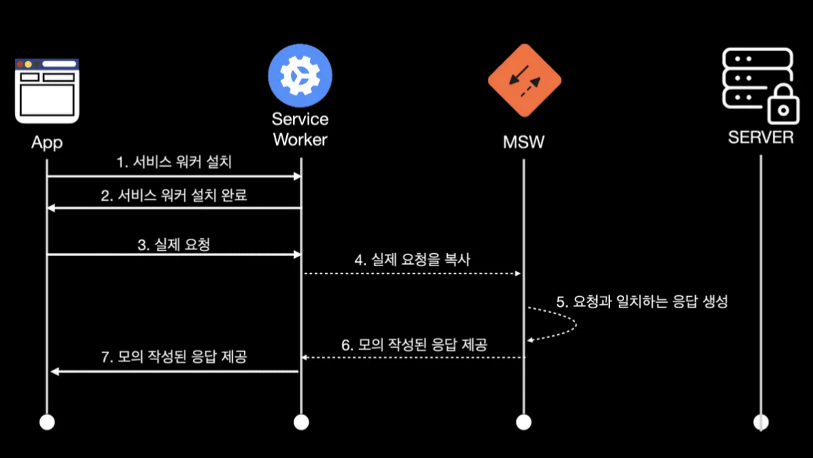

# MSW

## MSW?

- MSW(Mock Service Worker)는 서비스 워커(Service Worker)를 사용하여 네트워크 호출을 가로채는 API 모킹(mocking) 라이브러리이다. 이는 Service Worker API를 활용해서 네트워크 레벨에서 실제 HTTP 요청을 가로챈 다음 개발자가 미리 작성한 모의 응답을 보내주는 역할을 한다.
- 비스 워커(Service Worker)는 브라우저의 메인 쓰레드와 분리된 쓰레드인 백그라운드에서 자바스크립트를 실행할 수 있는 기술 중 하나이다. MSW는 이 기술을 기반으로 동작하기 때문에 애플리케이션의 동작을 방해하지 않고 별도로 네트워크 요청을 감시하고 있다가 요청이 발생하면 이를 가로채서 미리 작성된 모의 응답을 제공해준다.

### 

## MSW 활용

- 백엔드 API 개발과 프론트엔드 UI 개발이 동시에 진행되야하는 경우
- 테스트 실행 시 실제 백엔드 API에 네트워크 호출을 하는 대신에 훨씬 빠르고 안정적인 가짜 API 서버를 구축하는 경우

## MSW 특징

- 기존 API 모킹 라이브러리 대비 MSW의 가장 큰 강점은 모킹이 네트워크 단에서 일어나기 때문에 프론트엔드 코드를 실제 백엔드 API와 네트워크 통신하는 것과 크게 다르지 않게 작성할 수 있다는 것이다. 이 말은 나중에 가짜 API를 실제 API로 대체하는 것이 쉽다는 뜻이며 그만큼 프론트엔드 프로젝트 생산성이 올라가는 것을 의미한다.
- 뿐만 아니라 라이브러리가 상당히 유연하게 디자인이 되어 있어서 개발용으로 브라우저 환경에서 서비스 워커로 돌리든 테스트용으로 Node.js 환경에서 Jest나 Cypress와 같은 테스트 러너로 돌라든 동일한 요청 핸들러(handler) 코드를 공유해서 사용할 수 있다는 것이다. 이 말은 API 모킹을 위해서 작성해야 하는 코드를 최소화할 수 있다는 뜻이며 역시 개발 생산성 뿐만 아니라 유지 보수성 측면에서도 긍정적인 효과를 가져올 것이다.

## Getting Started

### install

```bash
npm install msw --save-dev
# or
yarn add msw --dev
```

### define mocks

```bash
mkdir src/mocks
touch src/mocks/handlers.js
```

### Choose API

#### Mocking REST API

```ts
// src/mocks/handlers.js
import { rest } from 'msw'

export const handlers = [
  rest.post('/login', (req, res, ctx) => {
    // Persist user's authentication in the session
    sessionStorage.setItem('is-authenticated', 'true')

    return res(
      // Respond with a 200 status code
      ctx.status(200),
    )
  }),

  rest.get('/user', (req, res, ctx) => {
    // Check if the user is authenticated in this session
    const isAuthenticated = sessionStorage.getItem('is-authenticated')

    if (!isAuthenticated) {
      // If not authenticated, respond with a 403 error
      return res(
        ctx.status(403),
        ctx.json({
          errorMessage: 'Not authorized',
        }),
      )
    }

    // If authenticated, return a mocked user details
    return res(
      ctx.status(200),
      ctx.json({
        username: 'admin',
      }),
    )
  }),
]
```

#### Mocking GraphQL API

##### Supported clients

Any GraphQL client that complies with the GraphQL operations specification can be used with Mock Service Worker. A client must dispatch requests with the following signature:

```ts
interface GraphQLRequest {
  query: string
  variables?: Record<string, any>
}
```

> Some GraphQL clients append extra information to the request's payload. That information will be available in the response resolver function.

```ts
// src/mocks/handlers.js
import { graphql } from 'msw'

export const handlers = [
  // Handles a "Login" mutation
  graphql.mutation('Login', (req, res, ctx) => {
    const { username } = req.variables
    sessionStorage.setItem('is-authenticated', username)

    return res(
      ctx.data({
        login: {
          username,
        },
      }),
    )
  }),

  // Handles a "GetUserInfo" query
  graphql.query('GetUserInfo', (req, res, ctx) => {
    const authenticatedUser = sessionStorage.getItem('is-authenticated')

    if (!authenticatedUser) {
      // When not authenticated, respond with an error
      return res(
        ctx.errors([
          {
            message: 'Not authenticated',
            errorType: 'AuthenticationError',
          },
        ]),
      )
    }

    // When authenticated, respond with a query payload
    return res(
      ctx.data({
        user: {
          username: authenticatedUser,
          firstName: 'John',
        },
      }),
    )
  }),
]
```

### Integrate

#### Browser

```bash
# Setup
npx msw init <PUBLIC_DIR> --save
# nextjs
npx msw init public/ --save
```

Configure worker

```bash
touch src/mocks/browser.js
```

```ts
// src/mocks/browser.js
import { setupWorker } from 'msw'
import { handlers } from './handlers'

// This configures a Service Worker with the given request handlers.
export const worker = setupWorker(...handlers)
```

Start worker

```ts
// src/index.js
import React from 'react'
import ReactDOM from 'react-dom'
import App from './App'

if (process.env.NODE_ENV === 'development') {
  const { worker } = require('./mocks/browser')
  worker.start()
}

ReactDOM.render(<App />, document.getElementById('root'))
```

Using ```homepage``` property in ```package.json```

- Let's say that your package.json has the following line: ```"homepage": "/login/"```
- Your development environment will automatically open using ```localhost:3000/login```, without ```/``` at the end and your service worker will not work as expected. For this reason we have to update our ```src/index.js``` or ```src/index.tsx``` where we rewrite ```window.location.pathname``` string with ```/``` at the end:

```ts
// src/index.js
import React from 'react'
import ReactDOM from 'react-dom'
import App from './App'

async function main() {
  if (process.env.NODE_ENV === 'development') {
    if (window.location.pathname === '/login') {
      window.location.pathname = '/login/'
      return
    }

    const { worker } = require('./mocks/browser')

    await worker.start({
      serviceWorker: {
        url: '/login/mockServiceWorker.js',
      },
    })
  }

  ReactDOM.render(
    <React.StrictMode>
      <App />
    </React.StrictMode>,
    document.getElementById('root'),
  )
}

main()
```

#### Browser

```bash
# Configure server
touch src/mocks/server.js
```

```ts
// src/mocks/server.js
import { setupServer } from 'msw/node'
import { handlers } from './handlers'

// This configures a request mocking server with the given request handlers.
export const server = setupServer(...handlers)
```

setup

Using Create React App

```ts
// src/setupTests.js
import { server } from './mocks/server.js'
// Establish API mocking before all tests.
beforeAll(() => server.listen())

// Reset any request handlers that we may add during the tests,
// so they don't affect other tests.
afterEach(() => server.resetHandlers())

// Clean up after the tests are finished.
afterAll(() => server.close())
```

Using Create React App

```touch jest.setup.js```

```ts
// jest.config.js
module.exports = {
  setupFilesAfterEnv: ['./jest.setup.js'],
}
```

run tests

```ts
// test/Login.test.js

test('allows user to log in', async () => {
  // Render components, perform requests, receive mocked responses.
})
```

Direct usage

```ts
const server = setupServer(
  // NOT "/user", nothing to be relative to!
  rest.get('https://api.backend.dev/user', (req, res, ctx) => {
    return res(ctx.json({ firstName: 'John' }))
  }),
)
```
